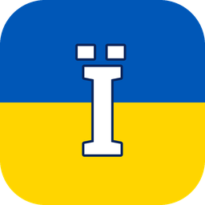
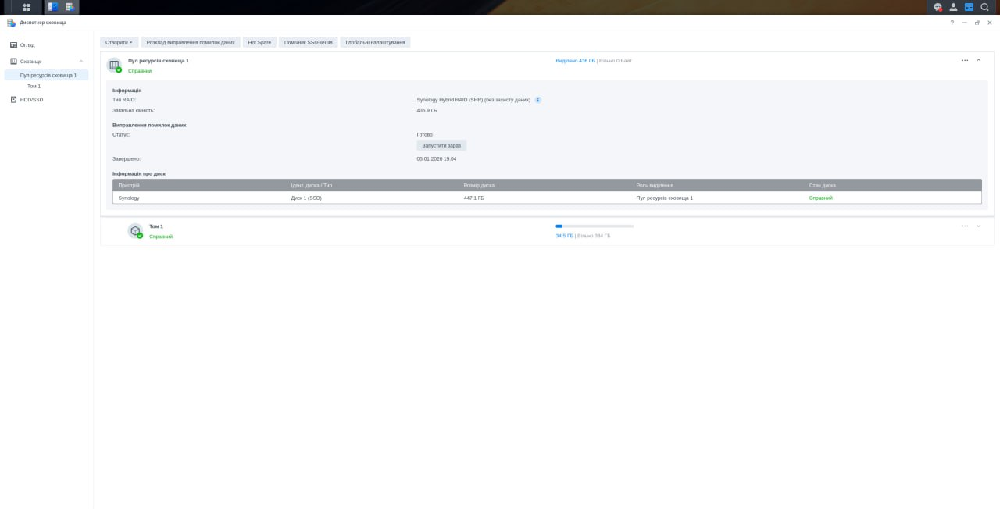
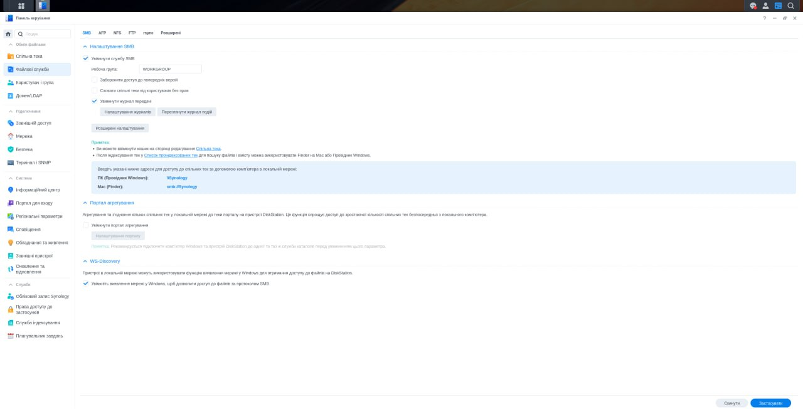
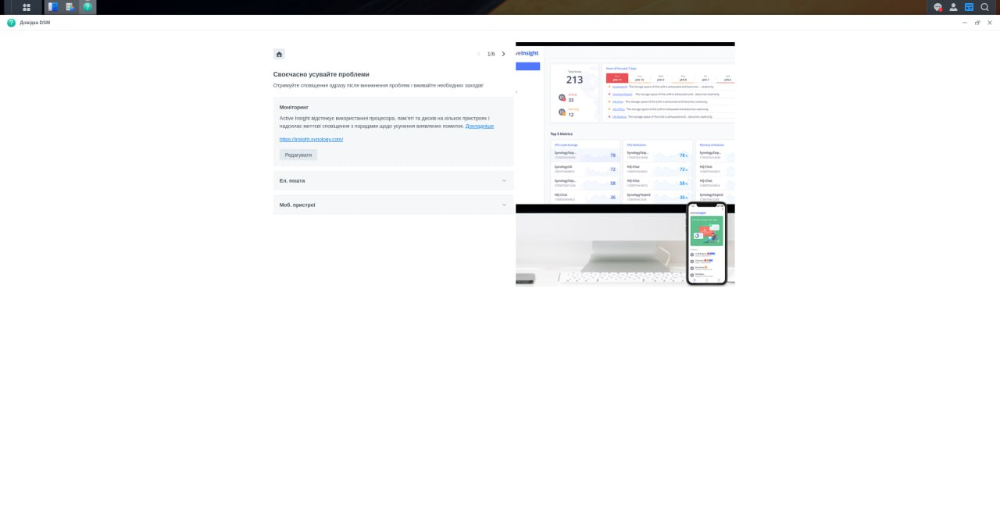

<div align="center">



# Українізатор DSM 🇺🇦

**Повна українізація інтерфейсу Synology DSM та встановлених пакетів — у пару кліків, без терміналу.**


</div>

> Synology офіційно **не має української локалі**. Цей пакет ставить повноцінний український
> переклад прямо в DSM: інтерфейс системи, меню, майстри, **email-сповіщення** і тексти
> встановлених пакетів. Вмикаєш галочками що саме перекласти — і одна кнопка робить решту.
> Так само легко відкочується байт-в-байт назад.

---

## 🇬🇧 In short

Synology DSM ships **no Ukrainian locale**. This DSM package overlays a full Ukrainian
translation onto the system UI, wizards, email notifications and installed-package strings.
Pick components with checkboxes, hit one button — a root daemon swaps the locale file
contents in place (pristine originals are kept forever for a byte-exact rollback). A small
systemd timer re-applies the translation automatically after DSM/package updates.

---

## 📸 Як це виглядає

DSM повністю українською — інтерфейс, меню, майстри, довідка:

| Диспетчер сховища | Панель керування |
|:---:|:---:|
|  |  |



---

## ✨ Можливості

- **Українізація DSM і пакетів** — 99 компонентів: ядро DSM 7.2.2, Центр пакетів, File Station,
  Surveillance Station, Active Backup, Hyper Backup, Synology Drive, Photos, MailPlus, Virtual
  Machine Manager, Container Manager й десятки інших.
- **Переклад не лише UI, а й email-сповіщень** (`mails`) — листи про події (бекапи, рейд, диски,
  безпека тощо) теж приходять українською.
- **Вибірково, по галочках** — перекладай що хочеш, рештою не чіпай. Кожен компонент має
  окремо рядки інтерфейсу (`strings`) і шаблони листів (`mails`).
- **Чесний відкат байт-в-байт** — при першому застосуванні зберігається недоторканий
  оригінал (`.orig`), тож «Повернути оригінал» повертає рідні файли точно, без сюрпризів.
- **Авто-відновлення після оновлень** — оновлення DSM чи пакета перезаписує локалі й «з'їдає»
  переклад. Фоновий systemd-таймер (раз на ~15 хв + на буті) сам переповерхає українізацію
  назад. Нічого робити руками не треба.
- **Авто-перемикання мови DSM** — переклад «живе» в локалі `rus` (див. нижче чому), тож апка
  сама виставляє мову інтерфейсу на потрібну, щойно щось українізовано.
- **Живий лог** — видно що саме, в якому файлі й з яким статусом патчиться.
- **Вбудована Root-консоль** — міні-термінал прямо в апці (під подвійним замком: сесія адміна
  DSM + пароль) для діагностики без SSH.
- **Чисте видалення** — знімаєш «двигун», прибираються таймер і службові файли; переклади
  можна повернути на оригінал перед видаленням.

---

## 🧠 Як це працює

Synology не дає додати власний код мови (`ukr`) — DSM ламає інтерфейс, якщо локаль невідома
системі. Тому Українізатор іде хитрішим, але безпечним шляхом:

1. **Підміна вмісту, а не коду локалі.** DSM тримає тексти інтерфейсу у файлах локалі `rus`.
   Апка замінює **вміст** цих файлів українським перекладом, лишаючи код локалі `rus`. Для DSM
   це досі «російська», а на екрані — українська. Жодного зламаного UI.
2. **Точні шляхи з маніфесту.** Локалі розкидані дуже по-різному: `…/ui/texts/rus`,
   `…/app/texts/rus`, абсолютні системні шляхи ядра DSM, Центру журналів, Порадника з безпеки.
   Усі точні шляхи запечені в `payload/manifest.json`, який збирається разом із перекладом —
   жодних здогадок у коді.
3. **Привілейовану роботу робить root-демон.** Непідписаному community-пакету DSM не дає прав
   root (cgi виконується як package-user, POST ріже 403). Тому переклади пише окремий локальний
   root-демон (`127.0.0.1:7686`), а веб-морда говорить із ним через nginx-аліас `/ua-l10n-api/`.
4. **Подвійний гейт безпеки.** Кожен виклик демона перевіряється: (1) чинна сесія адміна DSM
   (cookie `id=` + `X-SYNO-TOKEN`, звірені через `SYNO.Core.CurrentConnection`); а
   привілейовані/деструктивні дії (apply/revert/exec/мова) — **ще й пароль адмін-акаунта**
   (звірка з `/etc/shadow` через `crypt`). Демон слухає лише `127.0.0.1`, зовні недоступний.
5. **Скидання UI-кешу.** DSM кешує скомпільоване меню в `js_config_parser`; апка чистить кеш
   після кожної зміни (той самий крок, що робить штатний пост-інстал Synology), DSM регенерує сам.

### Архітектура

```
Браузер (апка ExtJS)
      │  Cookie + X-SYNO-TOKEN
      ▼
nginx  ──alias /ua-l10n-api/──►  root-демон 127.0.0.1:7686  (ua-l10n-api.py)
                                        │   гейт: сесія адміна + пароль
                                        ▼
                                  uacore.py  ──►  локалі rus у DSM/пакетах
                                        │              (.orig = оригінал, .bak = відкат)
                                        ▼
                                  systemd-таймер  ──►  авто-reapply після оновлень
```

| Файл | Роль |
|------|------|
| `pkgroot/ui/ua-l10n.js` | веб-морда (ExtJS `SYNO.SDS.AppWindow`): список компонентів, кнопки, лог, попап донату |
| `pkgroot/bin/ua-l10n-api.py` | root-демон: HTTP-API, автентифікація сесії + пароля |
| `pkgroot/bin/uacore.py` | ядро: статус/apply/revert/export, авто-таймер, перемикання мови |
| `pkgroot/payload/manifest.json` | джерело правди: `cid → {live-шлях, назва, версія}` |
| `pkgroot/payload/comp/<cid>/{strings,mails}` | власне переклади |
| `pkgroot/nginx/dsm.ua-l10n.conf` | nginx-аліас на демон |

---

## 🎯 Для яких версій актуальний переклад

Переклад зібрано й звірено під ці версії (станом на реліз **1.0.0**):

- **DSM:** `7.2.2-72806 Update 8` — ядро системи + 37 системних компонентів (меню, майстри,
  Центр пакетів, Центр журналів, Порадник з безпеки, email-сповіщення системи тощо).
- **Пакети Synology:** 62 компоненти — версії нижче.

На **новіших** версіях DSM/пакетів апка теж працює: перекладається все, що збіглося, а нові/змінені
рядки просто лишаються рідними (не патчаться) — це безпечно, нічого не ламається. Якщо версія
пакета відрізняється — переклад однаково накладається, бо файли локалі між мінорними версіями
зазвичай сумісні.

<details>
<summary><b>Повний список пакетів і цільових версій (62)</b></summary>

| Пакет | Версія | Пакет | Версія |
|-------|--------|-------|--------|
| ActiveBackup | 3.1.0-24967 | MailPlus-Server | 4.0.1-21663 |
| ActiveBackup-GSuite | 2.3.0-14256 | MailServer | 1.7.7-20677 |
| ActiveBackup-Office365 | 2.6.3-14235 | MailClient | 4.0.1-22254 |
| ActiveInsight | 3.0.5-24122 | MediaServer | 2.2.1-3406 |
| AIConsole | 1.2.1-0483 | NoteStation | 2.6.8-3910 |
| AntiVirus | 1.5.7-3241 | OAuthService | 1.1.5-0111 |
| AudioStation | 7.2.0-5516 | PDFViewer | 1.3.0-1204 |
| BackupRestoreManager | 2.5.2-12503 | PrestoServer | 2.1.3-1673 |
| BitDefenderForMailPlus | 1.1.0-20108 | ProxyServer | 5.2.0-1204 |
| Calendar | 3.0.2-21433 | QuickConnect | 1.0.9-0171 |
| Chat | 2.4.5-22148 | RadiusServer | 3.0.27-0516 |
| CloudSync | 2.7.2-2714 | ScsiTarget | 1.0.12-0338 |
| CMS | 3.1.4-1221 | SecureSignIn | 1.1.6-0391 |
| CodecPack | 4.0.0-4025 | SMBService | 4.15.13-2503 |
| Contacts | 1.0.10-20659 | SnapshotReplication | 7.4.6-1699 |
| DhcpServer | 1.0.2-0048 | Spreadsheet | 3.7.2-22592 |
| DirectoryServer | 2.4.59-2815 | SSOServer | 3.0.6-0485 |
| DirectoryServerForWindowsDomain | 4.15.13-0630 | StorageAnalyzer | 2.1.0-0620 |
| DNSServer | 9.16.34-6205 | StorageManager | 1.0.0-00502 |
| DownloadStation | 4.1.2-5012 | SurveillanceStation | 9.2.5-11979 |
| exFAT-Free | 7.2.0-0354 | SurveillanceVideoExtension | 1.0.0-0015 |
| FileStation | 1.4.2-1575 | SynoFinder | 1.7.1-0800 |
| GlacierBackup | 1.5.2-1323 | SynologyApplicationService | 1.8.2-20726 |
| HybridShare | 1.5.2-1831 | SynologyDrive | 4.0.3-27892 |
| HyperBackup | 4.1.2-4045 | SynologyPhotos | 1.9.0-10924 |
| HyperBackupVault | 4.1.2-4045 | TextEditor | 1.2.5-0254 |
| LogCenter | 1.3.0-1667 | USBCopy | 2.2.1-1306 |
| Virtualization (VMM) | 2.7.0-12229 | VPNCenter | 1.4.10-2984 |
| WebDAVServer | 2.4.8-20135 | WebStation | 4.3.0-0528 |

Машиночитний список усіх 99 компонентів із точними шляхами — у [`pkgroot/payload/manifest.json`](pkgroot/payload/manifest.json).

</details>

---

## 📦 Встановлення

### Крок 1. Постав пакет
1. Завантаж `UkrainianL10n.spk` з розділу [Releases](../../releases).
2. **DSM → Центр пакетів → Ручне встановлення**.
3. Вибери `.spk` → **Далі** → погодься на попередження про невідомого видавця (це нормально для
   community-пакетів) → **Готово**.

### Крок 2. Один раз увімкни «двигун» (root-крок) ⚠️
Робиться **лише раз на цьому NAS**. Без цього кнопки апки не працюють — це безпека Synology
(непідписаному пакету root не дають автоматично, і це не обійти).

**Спосіб А — прямо в апці (без SSH):** відкрий апку → у банері тисни **«Активувати двигун»** →
введи пароль адміна. Апка створить разову root-задачу в Планувальнику й запустить її сама.

**Спосіб Б — Планувальник завдань вручну:** Панель керування → Планувальник завдань → Створити
→ Запланована задача → Скрипт користувача, користувач **root**, команда:
```sh
sh /var/packages/UkrainianL10n/target/bin/ua-l10n-bootstrap.sh install
```
Збережи → вибери задачу → **Виконати**.

**Спосіб В — SSH:**
```sh
sudo sh /var/packages/UkrainianL10n/target/bin/ua-l10n-bootstrap.sh install
```

### Крок 3. Користуйся
1. Відкрий **«Українізатор DSM»**.
2. Постав галочки на тому, що перекласти (ядро DSM + пакети).
3. **«Українізувати вибране»** → введи пароль адмін-акаунта DSM.
4. Дивись живий лог. Натисни **Ctrl+F5**, щоб DSM перемалював інтерфейс.

**Відкат:** кнопка **«Повернути оригінал»** — повертає рідні (російські) файли байт-в-байт.

---

## 🔁 Після оновлень DSM/пакетів

Оновлення перезаписує локалі своїми. Робити нічого не треба — фоновий таймер
(`ua-l10n-reapply.timer`, на буті + кожні ~15 хв) сам повертає українізацію вибраних компонентів.

Зняти двигун (вимкнути таймер і прибрати службові файли):
```sh
sudo sh /var/packages/UkrainianL10n/target/bin/ua-l10n-bootstrap.sh remove
```

---

## 🛠 Збірка з вихідників

```sh
git clone https://github.com/alexbadcat/synology-dsm-ukrainizer.git
cd synology-dsm-ukrainizer
sh build.sh        # → UkrainianL10n.spk
```
`build.sh` пакує `pkgroot/` у `package.tgz`, далі загортає `INFO + package.tgz + scripts + conf +
іконки` у `.spk`. Жодних залежностей, чистий `tar` + `gzip`.

---

## ❓ Нюанси

- **Сумісність:** DSM 7.0+. Переклади запечені під DSM 7.2.2-72806; на іншій версії UI-частина
  працює, але деякі рядки можуть лишитись рідними (просто не патчаться) — це безпечно.
- **Чому переклад у локалі `rus`, а не `ukr`?** Synology не дозволяє додати новий код мови — UI
  ламається. Підміна вмісту `rus` — єдиний робочий спосіб без зламаного інтерфейсу.
- **Root-крок** повторюється, якщо переставити пакет наново.
- **Жодних даних назовні.** Демон слухає лише `127.0.0.1`, нічого нікуди не шле.

---

## ❤️ Підтримати

Проєкт некомерційний — роблю у вільний час, щоб софт говорив українською. Якщо корисно —
можна закинути копійчину на банку: **[send.monobank.ua/jar/8FCf878bY4](https://send.monobank.ua/jar/8FCf878bY4)**.
Кнопка **«❤️ Підтримати»** з QR є і всередині апки. Дякую! 🍺

---

## 📜 Ліцензія

[MIT](LICENSE). Переклади — community-надбання, користуйся й покращуй вільно.

**Слава Україні! 🇺🇦**
